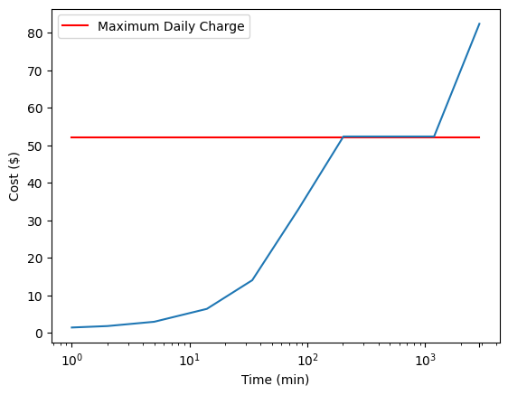

## veoride-cost-analysis
Cost analysis of Veorides in the Champaign-Urbana area.

# Costs:

[User agreement](https://www.veoride.com/user-agreement/) for reference

Cosmo/Astro: $1 to unlock, $0.35 per minute.

Cosmo speed: [8, 17] mph, range of 45 miles [cosmo](https://shop.veoride.com/products/cosmo-s)
Astro speed: [6, 15] mph, range of 43 miles [astro](https://www.veoride.com/astro/)

Taxes:
Sales tax: 9% of total in CU-area.

Rental fees/charges [user-agreement](https://www.veoride.com/user-agreement/#:~:text=3.5.%20MAXIMUM%20RENTAL%20TIME%20AND%20CHARGES.)
Continuous rental time: 48 hours 
Maximum daily charge: $48 or accumulated rental, whichever is less.
Potential Service fee: $30 for rentals in excess of 24 hours.

# Current Activity:

